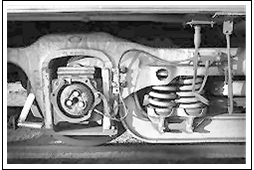
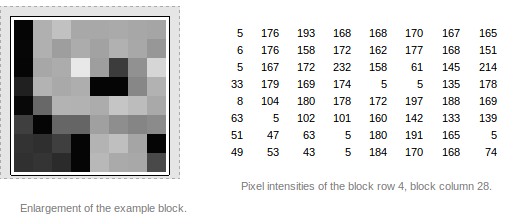
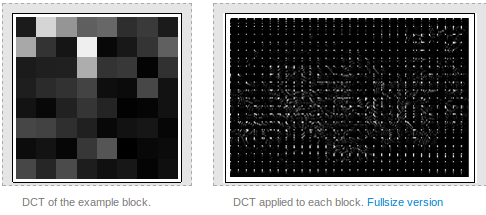
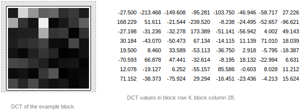
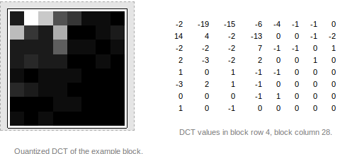
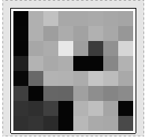
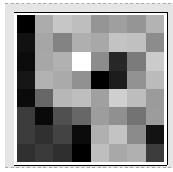

#   Veri Sıkıştırma

.fx: first

pasali `<mhmtbsl@bil.omu.edu.tr>`

http://mhmtbsl.net/

Kasım 2013

---

##   Giriş

Nedir?
: Verilen diskte daha az yer kaplaması için belirli bir algoritmaya dayalı `bit`
  seviyesinde yapılan işlem

---

##  Niye Kullanıyoruz ?

-   Verilerin daha az yer kaplaması
-   Verilen yedeklenmesi ve arşivlenmesi
-   İndirme/Yükleme işlemlerinin hızlanması
-   Verilen korunması

---

##  Sıkıştırma Teknikleri

-   İki çeşit sıkıştırma türü vardır

        * Kayıplı sıkıştırma

        * Kayıpsız sıkıştırma

---

##  Kayıplı Sıkıştırma

-   Veri kaybının önemsiz olduğu durumlarda
-   Ses, resim ya da video dosyalarında
-   Jpeg, Mpeg, Mp3, Mp4...
-   Kayıplı olduğu için sıkıştırma oranı yüksek

---

##  Kayıpsız Sıkıştırma

-   Verilerin kritik olduğu durumlarda
-   Eksiksiz geri dönüşüm gerektiren dosyalarda
-   Metin dosyaları, programlar ya da kaynak kodlar
-   Djvu, Rar, Zip, Tar...
-   Kayıp az olduğu için sıkıştırma oranı düşük

---

##  Jpeg

4 aşamadan oluşmakta:

-   Preprocessing
-   Transformation
-   Quantization
-   Encoding

---

##  Preprocessing

-   RGB renk uzayından YCbCr dönüştür
-   8x8'lik piksel bloklarına böl
-   Her pikselden 127 değerini çıkar

---

##  Transformation

DCT (The Discrete Cosine Transformation)

-   Jpeg dosya sıkıştırma işleminde kullanılan bir standart
-   Matemiksel bir işlem
-   8x8'lik bloklara DCT uygula
-   Matematiksel işlemlere ugun hale getir

---

##  Quantization

-   Değeri sıfır yakın pikselleri  sıfır yap
-   Büyük değerli pikselleri daralt ve sıfıra yaklaştır
-   Piksel değerlerini tamsayıya yuvarla

---

##  Quantization (Devam)

Önce
:

Sonra
:

---

##  Encoding

-   Huffman algoritmasını uygula (kayıpsız sıkıştırmada bahsedilecek)
-   Her bite 127 ekle

Önce:

Sonra:

